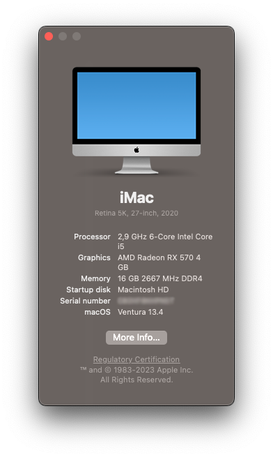

# ASRock B460M PRO4 OpenCore EFI
EFI for ASRock B460M PRO4 + I5 10400F + PowerColor Radeon RX 570 Red Dragon 4GB

This Hackintosh is based on OpenCore `0.9.2` and runs `macOS Ventura 13.4`  
Made using [Dortania Guide](https://dortania.github.io/OpenCore-Install-Guide/) for [Comet Lake](https://dortania.github.io/OpenCore-Install-Guide/config.plist/comet-lake.html#starting-point).

    

## Hackintosh Specs
* CPU: Intel Core i5-10400F
* GPU: PowerColor Radeon RX 570 Red Dragon 4GB
* MOBO: ASRock B460M PRO4
* RAM: HyperX Fury RGB 16GB (2x8GB) 2666MHz
* SSD M.2: WD SN550 500GB

## Working Things
iServices  
Audio  
USB  
Sleep and Hibernation  
FaceTime Calls   

## BIOS
* Secure Boot: OFF
* VT-x: ON
* FastBoot: OFF

## SSDTs

Compiled using [SSDTTime](https://github.com/corpnewt/SSDTTime)

* SSDT-AWAC
* SSDT-EC-USBX
* SSDT-PLUG

## Kexts

All kexts downloaded from official repos

* [AppleALC.kext](https://github.com/acidanthera/AppleALC) - Audio
* [IntelMausi.kext](https://github.com/acidanthera/IntelMausi) - Ethernet
* [Lilu.kext](https://github.com/acidanthera/Lilu) - Patches
* [NVMeFix.kext](https://github.com/acidanthera/NVMeFix) - Something for NVMe drive
* [VirtualSMC](https://github.com/acidanthera/VirtualSMC) - SMC emulator
* [WhateverGreen.kext](https://github.com/acidanthera/WhateverGreen) - Graphics patches

## Notes

Serial Numbers are generated using [GenSMBIOS](https://github.com/corpnewt/GenSMBIOS)
Built without WIFI and Bluetooth card

## Source Code

- [OpenCore bootloader](https://github.com/acidanthera/OpenCorePkg)
